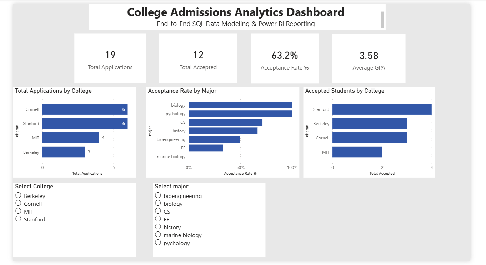

# College Admissions Analytics Dashboard

## 📌 Project Overview
This project demonstrates an end-to-end data analytics workflow using SQL for data modeling and Power BI for interactive reporting.

The dashboard analyzes college applications, acceptance rates, GPA distribution, and admissions performance across colleges and majors.

## 📊 Dashboard Preview



---

## 🛠 Tools & Technologies
- SQL (Schema Design & Analytical Queries)
- Power BI (Data Modeling, DAX, Dashboard Development)
- GitHub (Version Control & Portfolio Hosting)

---

## 📊 Dashboard Features
- KPI Cards:
  - Total Applications
  - Total Accepted
  - Acceptance Rate %
  - Average GPA
- Applications by College
- Acceptance Rate by Major
- Accepted Students by College
- Interactive Slicers (College & Major)

---

## 🗂 Project Structure

```
data/
 ├── college_admission_schema.sql
College_Admission_Dashboard.pbix
README.md
```
---

## 🚀 Key Skills Demonstrated
- Relational Database Design
- Fact & Dimension Modeling
- DAX Measures Creation
- Interactive Dashboard Design
- GitHub Project Documentation


